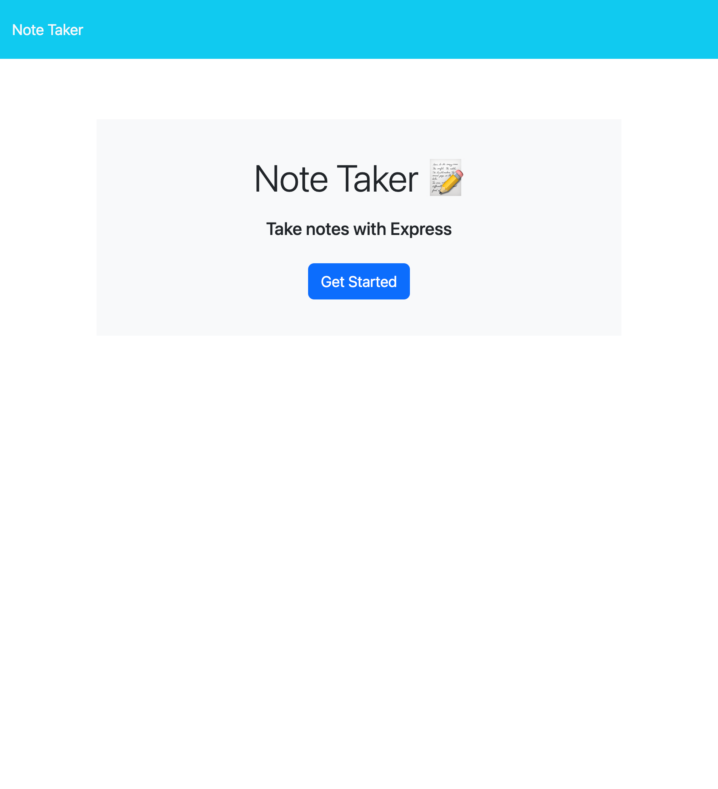
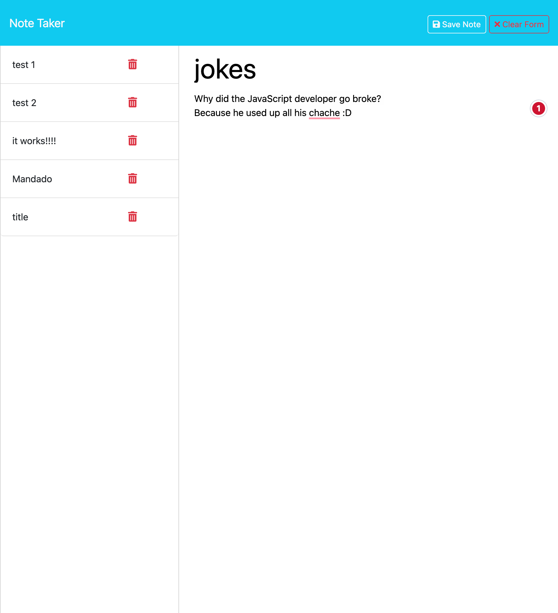
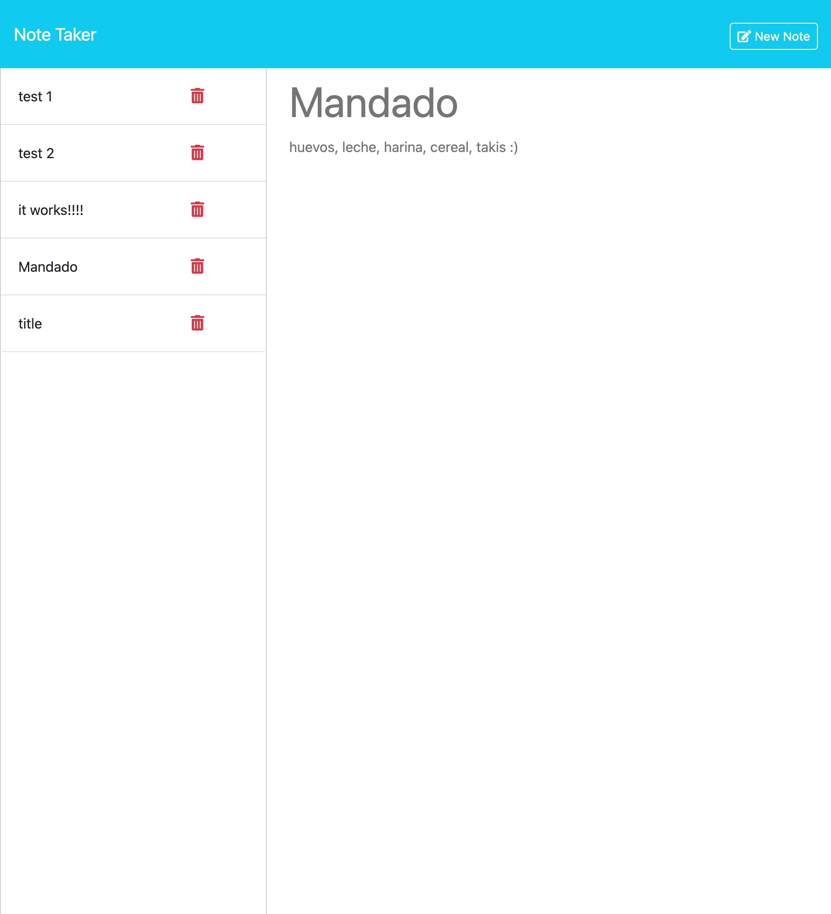

  # Take My Notes 

  ### Table of Contents 

  - [Description](#description)
  - [Packages](#packages)
  - [Installation](#installation)
  - [Usage](#usage)
  - [Credits](#credits)
  - [License](#license)
  - [Tests](#tests)
  - [Contact](#contact)

  ## Description
  This application helps the user jot down notes, weather it be for groceries, or just to write down important information. When the website is opened, the homepage will display a button that will take the user to the note taking application. Once there the user will be allowed to create notes as they see fit. By giving the note a title and information, the user will then be able to save their notes for future reference. The note will be saved and displayed on the left hand column and can be clicked again to view the information saved.  

  ## Packages
  This application will require for you to install :
  - `express 4.16.4`
  - `uuid 9.0.1`
  - `nodemon 3.0.1`

  ## Installation
1. Open the application  with the following link : 
2. Then click the “Get Started” button to start the application.
3. Enter a title for your note and fill the body with any text information (can be notes, lists, etc).
4. To save the desired note, click the “Save Note” button on the top right hand corner, or click “Clear Form” to disregard the note. 
5. If you want to look back at previously saved notes, look at the left hand column and click the desired note by the title name. 
6. To return to the Home Screen, click on the “Note Taker” title name on the top left corner.  

  ## Usage
  This application allows the user to create and save notes.

  ## Credits
  This was done with the help of my profeesor Tyler Calvert
  
  ## License
  none 
 
  ## Tests
  

  

  

  ### Contact 
  For any further questions, feel free to contact me through my GitHub [H3yJ4yy](https://github.com/H3yJ4yy) or Email [agon0015@gmail.com](mailto:agon0015@gmail.com).
